# StockSignal — Current Design Document

> **Generated:** 2026-03-30  
> **App Version:** Room DB v7  
> **Based on:** Exhaustive codebase analysis + [INITIAL_DESIGN.md](INITIAL_DESIGN.md) + git history

---

## Table of Contents

1. [Product Overview](#1--product-overview)
2. [Architecture Overview](#2--architecture-overview)
3. [Navigation & Screen Map](#3--navigation--screen-map)
4. [End-to-End Signal Pipeline](#4--end-to-end-signal-pipeline)
5. [Notification Scheduling & Delivery](#5--notification-scheduling--delivery)
6. [Signal Evaluation Engine](#6--signal-evaluation-engine)
7. [AI Scoring Layer](#7--ai-scoring-layer)
8. [Data Fetch & Caching](#8--data-fetch--caching)
9. [Notification Queuing & Throttling](#9--notification-queuing--throttling)
10. [User Interaction Flow](#10--user-interaction-flow)
11. [Boot & Recovery Flow](#11--boot--recovery-flow)
12. [Room Database Schema](#12--room-database-schema)
13. [Settings & Configuration](#13--settings--configuration)
14. [Stooq Network Layer](#14--stooq-network-layer)
15. [UI Components & Design System](#15--ui-components--design-system)
16. [Test Coverage](#16--test-coverage)
17. [Changes from Initial Design](#17--changes-from-initial-design)
18. [Not Yet Implemented](#18--not-yet-implemented)
19. [Class Reference by Layer](#19--class-reference-by-layer)

---

## 1 — Product Overview

StockSignal is an Android app that:

- Lets users **search stocks** (via Stooq.com) and add them to a **watchlist**.
- Shows a rich **Stock Detail** view with interactive charts (1D–5Y time ranges).
- Computes a five-level **signal** (Strong Buy → Strong Sell) with numeric score, confidence, and plain-language explanations using a **rule-based technical indicator engine + optional on-device AI enrichment** (Gemma3-1B-IT LLM).
- Sends **local notifications** for (A) signals related to the user's watchlist and (B) market movers (largest increasers/decreasers) even if not watched.
- All computation and notification generation happens **locally** — no backend server.
- Informational only — does not execute trades.

---

## 2 — Architecture Overview

```mermaid
flowchart TD
    subgraph UI["UI Layer (Jetpack Compose)"]
        WS[WatchlistScreen]
        MM[MarketMoversScreen]
        SF[SignalsFeedScreen]
        SD[StockDetailScreen]
        SS[SearchScreen]
        NS[NotesScreen]
        ST[SettingsScreen]
        OB[OnboardingScreen]
    end

    subgraph VM["ViewModel Layer"]
        WVM[WatchlistViewModel]
        MMVM[MarketMoversViewModel]
        SFVM[SignalsFeedViewModel]
        SDVM[StockDetailViewModel]
        SVM[SearchViewModel]
        NVM[NotesViewModel]
        STVM[SettingsViewModel]
        OBVM[OnboardingViewModel]
        ASVM[AppStateViewModel]
    end

    subgraph Domain["Domain Layer"]
        SE[SignalEngine]
        RBM[RuleBasedSignalModel]
        IC[IndicatorCalculator]
        IAE[IndicatorAlertEvaluator]
        ICfg[IndicatorConfig]
        IDE[IntradayDataExporter]
    end

    subgraph Data["Data Layer"]
        SR[SignalsRepository]
        StR[StockRepository]
        WR[WatchlistRepository]
        MR[MarketMoversRepository]
        SetR[SettingsRepository]
        AIS[AiSignalScorer]
        NTS[NewsTranslationService]
        LLM[LiteRtLlmRuntime]
    end

    subgraph Network["Network Layer"]
        SApi[StooqApi Retrofit]
        SBI[StooqBlockInterceptor]
        SRB[StooqRequestBlocker]
        EEG[ExternalExecutionGate Mutex]
    end

    subgraph Persistence["Persistence Layer"]
        RoomDB[(Room DB v7)]
        DS[(DataStore Settings)]
        DDS[(DataStore Diagnostics)]
    end

    subgraph Notifications["Notification Layer"]
        NS2[NotificationScheduler]
        NAR[NotificationAlarmReceiver]
        WRS[WindowRunService]
        NWR[NotificationWindowRunner]
        NQP[NotificationQueueProcessor]
        NP[NotificationPublisher]
        NACR[NotificationActionReceiver]
    end

    UI --> VM
    VM --> Data
    VM --> Domain
    Data --> Network
    Data --> Persistence
    Domain --> Data
    Notifications --> Data
    Notifications --> Domain
    Notifications --> Persistence
```

**Tech Stack:**
| Component | Technology |
|-----------|-----------|
| UI | Jetpack Compose + Material3 |
| Navigation | Compose Navigation (single-activity) |
| DI | Hilt |
| State | StateFlow + Kotlin Flow |
| Local DB | Room (v7, 9 entities) |
| Settings | DataStore (Preferences) |
| Charts | Vico (Compose) |
| Networking | Retrofit + OkHttp + Jsoup |
| Background | AlarmManager + Foreground Services |
| AI | LiteRT (Gemma3-1B-IT, on-device) |
| Concurrency | Kotlin Coroutines |

---

## 3 — Navigation & Screen Map

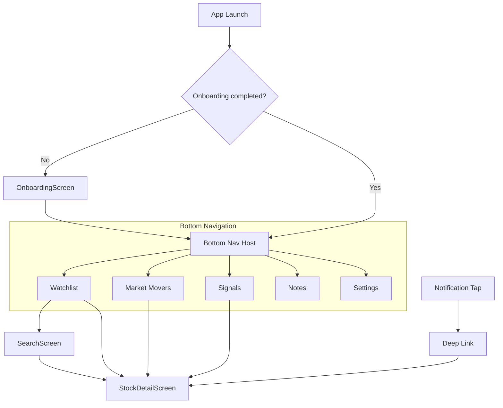

**Routes:**

| Screen | Route | Parameters |
|--------|-------|------------|
| Watchlist | `watchlist` | — |
| Market Movers | `movers` | — |
| Signals Feed | `signals` | — |
| Notes | `notes` | `?symbol={symbol}` (optional) |
| Settings | `settings` | — |
| Onboarding | `onboarding` | — |
| Search | `search` | — |
| Stock Detail | `stock/{ticker}` | `?eventId={id}&openAlerts={bool}` |

**Deep Link:** `stocksignal://stock/{TICKER}?eventId={ID}`

---

## 4 — End-to-End Signal Pipeline

This is the master diagram showing how a stock signal travels from raw price data to a notification on the user's phone.

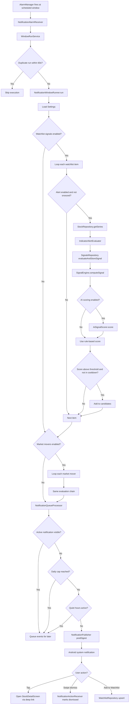

---

## 5 — Notification Scheduling & Delivery

### 5.1 — Scheduling Lifecycle

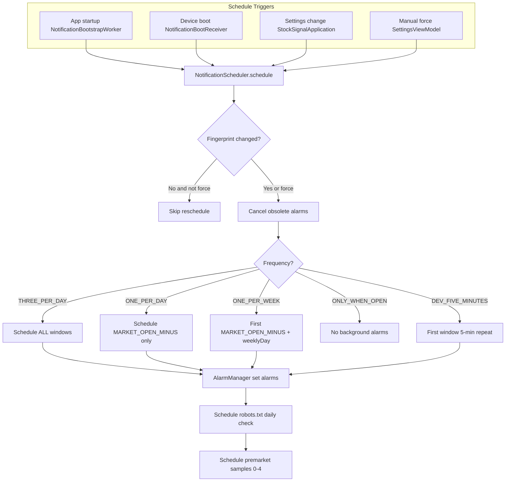

### 5.2 — Window Types

| Type | Intent Extra | Handler | Purpose |
|------|-------------|---------|---------|
| `TYPE_WINDOW` | `window` | `WindowRunService` | Main signal evaluation + notification posting |
| `TYPE_PRE_NOTIFY` | `pre_notify` | `WindowPreNotifyService` | Pre-fetch data ~1h before main window |
| `TYPE_ROBOTS` | `robots` | `RobotsTxtCheckWorker` | Daily Stooq robots.txt compliance check |
| `TYPE_PREMARKET` | `premarket` | `PremarketQuoteWorker` | Pre-market bid/ask data (5 samples, 10-min intervals) |

### 5.3 — Schedule Windows

Windows are configurable via `SettingsRepository` as `List<ScheduleWindow>`:

```kotlin
data class ScheduleWindow(
    val id: String,
    val type: ScheduleWindowType,  // FIXED_LOCAL or MARKET_OPEN_MINUS
    val hour: Int?, val minute: Int?,
    val offsetMinutes: Int?,       // e.g. -10 = 10 min before market open
    val zoneId: String?            // e.g. "America/New_York"
)
```

**Defaults:** 10 min before US market open (9:20 ET), 11:00 local, 14:00 local.

---

## 6 — Signal Evaluation Engine

### 6.1 — Computation Flow

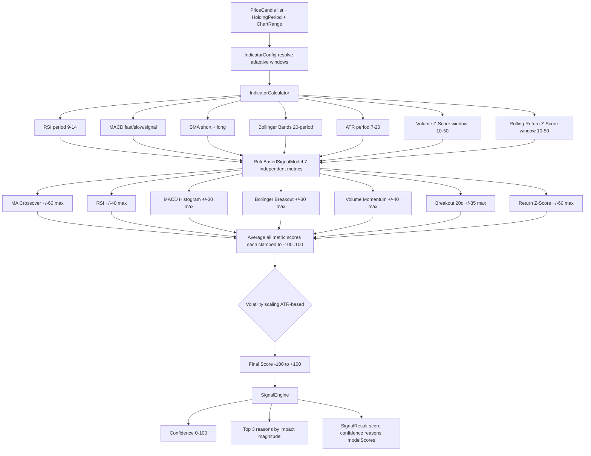

### 6.2 — Holding Period Adaptation

The `IndicatorConfig` adapts all indicator windows based on the user's `HoldingPeriod`:

| Period | SMA Short/Long | RSI | MACD (f/s/sig) | ATR | Vol Z | Return Z |
|--------|---------------|-----|----------------|-----|-------|----------|
| HOURS | 5 / 10 | 9 | 5/13/5 | 7 | 10 | 10 |
| DAYS | 10 / 20 | 14 | 8/17/5 | 10 | 15 | 15 |
| WEEKS | 20 / 50 | 14 | 12/26/9 | 14 | 20 | 20 |
| MONTHS | 50 / 100 | 14 | 12/26/9 | 14 | 30 | 30 |
| YEARS | 50 / 200 | 14 | 12/26/9 | 20 | 50 | 50 |

### 6.3 — Signal Tier Mapping

| Score Range | Tier | Label | Color |
|------------|------|-------|-------|
| 60 to 100 | STRONG_BUY | Strong Buy | Deep Green |
| 30 to 59 | BUY | Buy | Green |
| -29 to 29 | NEUTRAL | Hold | Gray |
| -59 to -30 | SELL | Sell | Amber |
| -100 to -60 | STRONG_SELL | Strong Sell | Red |

### 6.4 — Alertable Metrics

`IndicatorAlertEvaluator` monitors 8 metrics for threshold crossovers:

| Metric | What it Detects |
|--------|----------------|
| RSI_14 | Oversold (<30) / Overbought (>70) |
| MACD_HISTOGRAM | Momentum direction change |
| MACD_LINE | Trend reversal |
| SMA_50_DISTANCE | % distance from 50-period MA |
| SMA_200_DISTANCE | % distance from 200-period MA |
| BOLLINGER_PERCENT_B | Band position (breakout/breakdown) |
| ATR_PERCENT | Volatility spikes |
| ROLLING_RETURN_ZSCORE | Return anomaly detection |

---

## 7 — AI Scoring Layer

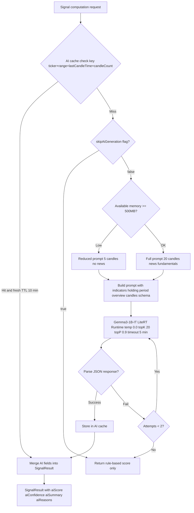

**AI Response Schema:**
```json
{
  "score": -100 to 100,
  "confidence": 0 to 100,
  "summary": "Brief analysis...",
  "reasons": [
    {"title": "...", "detail": "..."}
  ]
}
```

**Models Available:**
| Model | File | Size | Backend |
|-------|------|------|---------|
| Gemma3-1B-IT int4 (primary) | `gemma3-1b-it-int4.litertlm` | ~584 MB | CPU/GPU |
| Gemma3-270M q8 (legacy) | `gemma3-270m-it-q8.litertlm` | ~270 MB | CPU/GPU |

---

## 8 — Data Fetch & Caching

### 8.1 — Data Flow

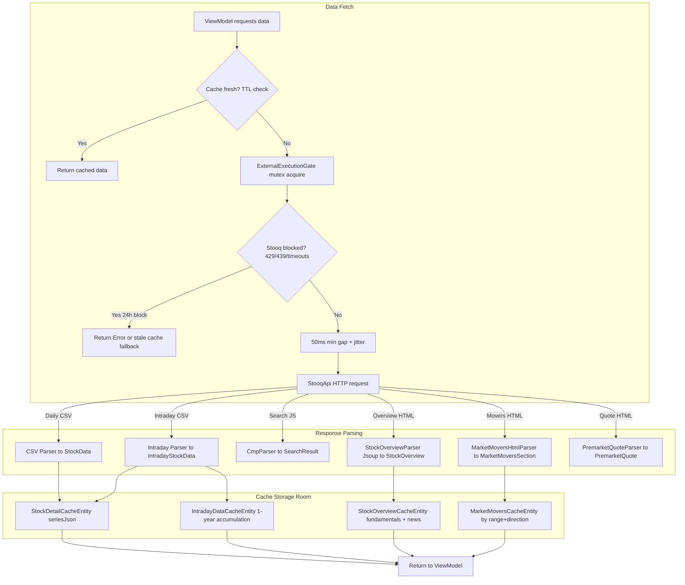

### 8.2 — Cache TTL Summary

| Resource | TTL | Storage | Retention |
|----------|-----|---------|-----------|
| Price series (intraday) | 10 minutes | Room (StockDetailCache) | Refreshed on demand |
| Price series (daily) | 24 hours | Room (StockDetailCache) | Refreshed on demand |
| Intraday candles (accumulated) | N/A | Room (IntradayDataCache) | **1 year rolling** |
| Market movers | 10 minutes | Room (MarketMoversCache) | Refreshed on demand |
| Stock overview + news | 24 hours | Room (StockOverviewCache) | Refreshed on demand |
| AI signal cache | 10 minutes | In-memory (AiSignalScorer) | Per (ticker, range, lastCandle) |
| Signal cooldown | 24 hours | Room (GlobalSignalEvent) | Per (ticker, tier) pair |
| Campaign ID | App lifetime | In-memory | Single fetch |

### 8.3 — Intraday Data Accumulation

`StockRepository.accumulateIntradayData()` passively builds a 1-year history of 10-minute candles:

1. Groups incoming candles by date
2. **Historical dates** (before today): stored once, never updated (immutable)
3. **Today's date**: mergeable — new candles are upserted with existing
4. Data older than 365 days is auto-deleted
5. Stored in `IntradayDataCacheEntity` (symbol + date composite PK)
6. Can be exported to CSV via `IntradayDataExporter`

### 8.4 — Stooq API Endpoints

| Endpoint | Method | Data | Parser |
|----------|--------|------|--------|
| `GET /` | Home page HTML | Campaign ID | Regex extraction |
| `GET /q/d/l/` | Daily CSV | OHLCV by date | Apache Commons CSV |
| `GET /q/a2/d/` | Intraday CSV | 10-min OHLCV | Custom CSV parser |
| `GET /cmp/` | JS callback | Search results | CmpParser (regex) |
| `GET /q/g/` | HTML tables | Fundamentals + news | Jsoup (StockOverviewParser) |
| `GET /q/` | HTML page | Bid/ask/volume | Regex (PremarketQuoteParser) |
| `GET /robots.txt` | Plain text | Crawl rules | String comparison |

---

## 9 — Notification Queuing & Throttling

### 9.1 — State Machine

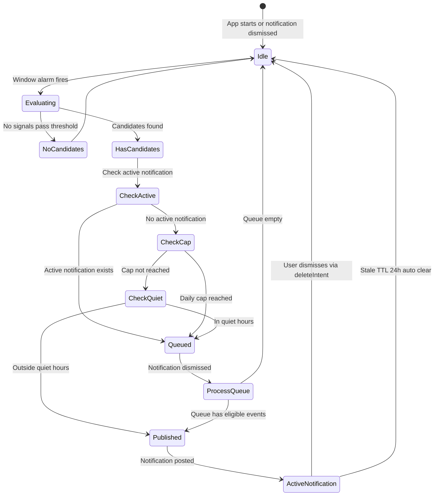

### 9.2 — Throttling Rules

| Rule | Implementation |
|------|---------------|
| **Active notification blocking** | Only one visible notification at a time. New events queued until user dismisses. |
| **Daily cap** | THREE_PER_DAY: max 3, ONE_PER_DAY: max 1, ONE_PER_WEEK: max 1 per week. Counter resets at midnight local time. |
| **Quiet hours** | Per-item override (`quietHoursStart/End`) falls back to global setting. Handles midnight wrap-around. |
| **Signal cooldown** | Same (ticker, tier) pair suppressed for 24 hours. |
| **Stale data** | Signals based on data older than 10 minutes are not posted as notifications. |
| **Duplicate run** | `WindowRunService` checks for run within last 60 seconds; skips if found. |

### 9.3 — Notification State Persistence

```kotlin
data class NotificationStateEntity(
    val lastActiveNotificationId: Int?,
    val lastActiveAt: LocalDateTime?,
    val dismissed: Boolean,
    val queuedEventIds: List<String>,
    val notificationCounts: Map<String, Int>,  // key = date/week, value = count
    val lastResetAt: LocalDateTime?
)
```

All state survives app/device restarts via Room persistence.

---

## 10 — User Interaction Flow

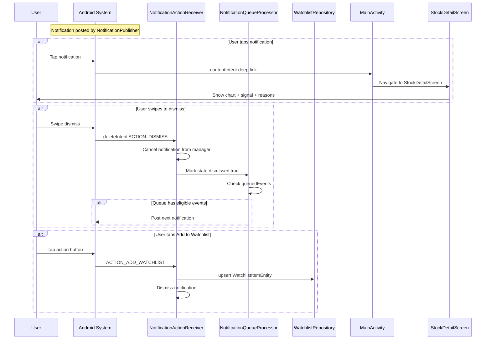

---

## 11 — Boot & Recovery Flow

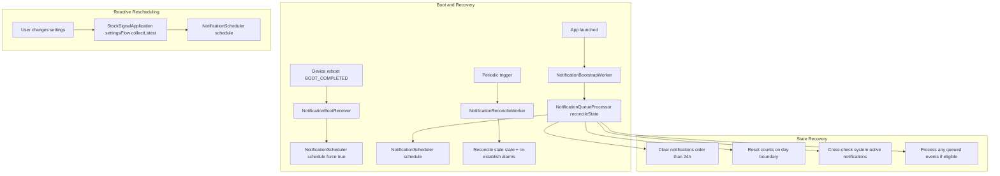

---

## 12 — Room Database Schema

**Database:** `StockSignalDatabase` — Version 7

### 12.1 — Entity Relationship

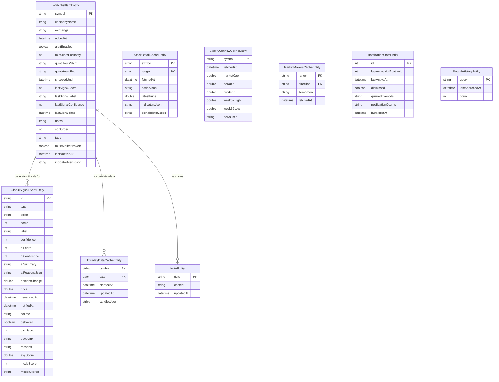

### 12.2 — Migration History

| Migration | Changes |
|-----------|---------|
| **1 → 2** | Added `indicatorAlertsJson` column to `watchlist_items` |
| **2 → 3** | Created `intraday_data_cache` table (symbol, date, createdAt, updatedAt, candlesJson) — **destructive reset** |
| **3 → 4** | Created `stock_overview_cache` table (marketCap, peRatio, dividend, week52High, week52Low, fetchedAt) |
| **4 → 5** | Added `newsJson` column to `stock_overview_cache` for headlines |
| **5 → 6** | Added AI scoring columns to `signal_events`: aiScore, aiConfidence, aiSummary, aiReasonsJson |
| **6 → 7** | Added `dismissed` INTEGER NOT NULL DEFAULT 0 to `signal_events` for swipe-to-dismiss |

### 12.3 — DAOs

| DAO | Entity | Key Operations |
|-----|--------|---------------|
| `WatchlistDao` | WatchlistItemEntity | observe, getBySymbol, getAll, upsert, updateSortOrder, delete |
| `SignalEventDao` | GlobalSignalEventEntity | observeEvents (filtered dismissed=0), observeEventsForTicker, getLatestForTickerAndLabel, dismissSignal, undoDismissSignal |
| `IntradayDataCacheDao` | IntradayDataCacheEntity | getCandlesByDateRange, upsert, deleteOldData |
| `MarketMoversCacheDao` | MarketMoversCacheEntity | getByKey, upsert |
| `StockDetailCacheDao` | StockDetailCacheEntity | getByKey, upsert |
| `StockOverviewCacheDao` | StockOverviewCacheEntity | getBySymbol, upsert |
| `NotificationStateDao` | NotificationStateEntity | getState, upsert |
| `NotesDao` | NoteEntity | observe, getByTicker, upsert, delete |
| `SearchHistoryDao` | SearchHistoryEntity | observeRecent, upsert, deleteAll |

---

## 13 — Settings & Configuration

### 13.1 — AppSettings Data Class

| Setting | Type | Default | Description |
|---------|------|---------|-------------|
| `frequency` | `NotificationFrequency` | THREE_PER_DAY | How often background notifications fire |
| `notificationTypes` | `Set<NotificationType>` | WATCHLIST, MARKET_MOVERS | Which event types generate notifications |
| `quietHours` | `QuietHours` | disabled | Start/end times for notification suppression |
| `scheduleWindows` | `List<ScheduleWindow>` | 9:20 ET, 11:00, 14:00 | Fixed or market-relative alarm times |
| `weeklyDay` | `DayOfWeek` | MONDAY | Day of week for ONE_PER_WEEK frequency |
| `snoozeDuration` | `SnoozeDurationOption` | — | Duration for per-stock snooze |
| `signalSensitivity` | `SignalSensitivity` | minScore=60 | Threshold for notification-worthy signals |
| `selectedChartRange` | `ChartRange` | varies by holdingPeriod | Default chart time range |
| `immediatePostsEnabled` | `Boolean` | false | Immediate notification delivery (vs windowed) |
| `offlineTranslationEnabled` | `Boolean` | false | Enable local LLM for AI scoring |
| `onboardingCompleted` | `Boolean` | false | Whether user completed onboarding |
| `holdingPeriod` | `HoldingPeriod` | MONTHS | User's investment timeframe |

### 13.2 — Key Enums

```kotlin
enum class NotificationFrequency {
    THREE_PER_DAY,    // Up to 3 notifications/day
    ONE_PER_DAY,      // Max 1/day
    ONE_PER_WEEK,     // Max 1/week
    ONLY_WHEN_OPEN,   // No background notifications
    DEV_FIVE_MINUTES  // Dev mode: 5-minute repeat (hidden)
}

enum class HoldingPeriod {
    HOURS,   // Day trading
    DAYS,    // Swing trading
    WEEKS,   // Short-term
    MONTHS,  // Position trading (default)
    YEARS    // Long-term investing
}

enum class NotificationType { WATCHLIST, MARKET_MOVERS, DIGESTS }

enum class SignalTier {
    STRONG_BUY, BUY, NEUTRAL, SELL, STRONG_SELL
}

enum class AiGenerationState {
    IDLE, QUEUED, GENERATING, COMPLETE, ERROR
}

enum class IndicatorMetric {
    RSI_14, MACD_HISTOGRAM, MACD_LINE,
    SMA_50_DISTANCE, SMA_200_DISTANCE,
    BOLLINGER_PERCENT_B, ATR_PERCENT,
    ROLLING_RETURN_ZSCORE
}
```

---

## 14 — Stooq Network Layer

### 14.1 — Request Pipeline

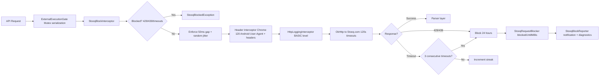

### 14.2 — Rate Limiting Details

| Mechanism | Value | Purpose |
|-----------|-------|---------|
| Minimum request gap | 50ms + jitter | Prevent Stooq rate limiting |
| Consecutive timeout threshold | 3 | Trigger 24h block |
| Block duration | 24 hours | HTTP 429/439 or 3 timeouts |
| Block notification throttle | 60 seconds | Avoid notification spam |
| Request timeout | 120 seconds | OkHttp connect/read/write |
| Execution gate | Single mutex | Serialize all HTTP + LLM operations |

### 14.3 — Compliance

- **robots.txt check:** Daily verification that Stooq's robots.txt hasn't changed from the expected `User-agent: *\r\nDisallow:\r\n`. Alert notification on mismatch.
- **Browser spoofing:** Full Chrome 120 Android (Pixel 7) headers to mimic mobile browser.
- **Disclaimer:** App shows "Powered by Stooq.com data" and "Not affiliated with Stooq."

---

## 15 — UI Components & Design System

### 15.1 — Design Tokens

- **Theme:** Dark-mode-first (with light mode support)
- **Color Palette:** Material3 dynamic colors with signal-specific overrides:
  - Strong Buy: Deep Green
  - Buy: Green
  - Neutral: Gray
  - Sell: Amber
  - Strong Sell: Red
- **Typography:** Material3 defaults with responsive sizing

### 15.2 — Reusable Components

| Component | File | Purpose |
|-----------|------|---------|
| `SignalChip` | `SignalChip.kt` | Colored tier badge (Strong Buy → Strong Sell) with optional info icon |
| `SignalScoreRow` | `SignalScoreRow.kt` | Composite: SignalChip + AI state indicator + score + confidence |
| `SignalBadge` | `SignalBadge.kt` | Alternative signal display variant |
| `InfoIconButton` | `InfoIconButton.kt` | 16dp info icon that opens InfoDialog on click |
| `InfoDialog` | `InfoDialog.kt` | Scrollable Material3 AlertDialog with HTML content |
| `MetricExplanations` | `MetricExplanations.kt` | HTML-formatted explanations for 16+ metrics and tiers |
| `ConfidenceExplanationDialog` | `ConfidenceExplanationDialog.kt` | Confidence metric breakdown dialog |
| `ChartFrame` | `ChartFrame.kt` | Vico chart wrapper with time-range tabs |
| `StockCard` | `StockCard.kt` | Styled card container with dark overlay |
| `TagChip` | `TagChip.kt` | User-defined tag chips |
| `CompanyExchangeText` | `CompanyExchangeText.kt` | Formatted company + exchange name |
| `HtmlText` | `HtmlText.kt` | HTML-to-Compose text renderer |

### 15.3 — AI Generation State Indicators

| State | Visual |
|-------|--------|
| IDLE | No indicator |
| QUEUED | Pulsing dot (animated alpha) |
| GENERATING | CircularProgressIndicator (spinner) |
| COMPLETE | No indicator (score displayed) |
| ERROR | No indicator (falls back to rule-based) |

---

## 16 — Test Coverage

### 16.1 — Test Suite (46 files)

| Area | Test Files | Coverage |
|------|-----------|----------|
| **Domain/Signal** | `IndicatorCalculatorTest`, `IndicatorCalculatorParameterizedTest`, `IndicatorConfigTest`, `SignalEngineTest`, `IndicatorAlertEvaluatorTest`, `IndicatorAlertIntegrationTest`, `TestDataBuilders` | Indicator math, scoring, alert evaluation |
| **AI Scoring** | `AiSignalScorerTest`, `AiSignalScorerNanoTimeTest`, `AiScoreReasonJsonTest` | Prompt building, response parsing, caching |
| **Parsers** | `CmpParserTest`, `MarketMoversHtmlParserTest`, `PremarketQuoteParserTest`, `StockOverviewParserTest`, `StockOverviewParserTimezoneTest` | HTML/CSV/JS parsing correctness |
| **Network** | `StooqApiTest`, `StooqApiLiveTest`, `StooqBlockInterceptorTest`, `StooqRequestBlockerTest`, `StooqRepositoryTest`, `StooqRepositoryLiveTest`, `StooqPremarketLiveTest`, `TestRateLimiter` | API calls, blocking, throttling |
| **Notifications** | `NotificationAlarmSchedulerTest`, `NotificationBootstrapWorkerUnitTest`, `NotificationDiagnosticsRepositoryLogTest`, `NotificationIntentFactoryTest`, `NotificationPublisherTest`, `NotificationQueueProcessorTest`, `NotificationWindowWorkerTest`, `PremarketQuoteWorkerTest` | Scheduling, queue processing, publishing |
| **Data/Repository** | `SignalsRepositoryTest`, `MarketMoversRepositoryTest`, `SignalEventDaoTest`, `IntradayDataCacheDaoTest`, `StockNewsJsonTest` | Signal persistence, cooldown, caching |
| **Compliance** | `RobotsTxtCheckWorkerTest`, `RobotsTxtCheckWorkerUnitTest`, `RobotsTxtCheckWorkerLiveTest` | robots.txt validation |
| **Translation** | `NewsTranslationServiceTest` | Model detection, download |
| **Integration** | `DataAccumulationIntegrationTest` | End-to-end intraday accumulation |
| **UI** | `SearchFormattingTest` | Price/percent formatting |
| **Export** | `IntradayDataExporterTest` | CSV export |
| **Core** | `ExternalExecutionGateTest` | Mutex serialization |
| **Util** | `HtmlUtilsTest` | HTML stripping |

### 16.2 — Testing Patterns

- **Unit tests:** JUnit + Mockk (mock repositories, DAOs)
- **Robolectric:** For tests needing Android context (Room, DataStore)
- **Live tests:** Marked with `@Ignore` or `@Tag("live")` — hit real Stooq API
- **Test data builders:** `TestDataBuilders.kt` provides PriceCandle generators
- **Parameterized tests:** `IndicatorCalculatorParameterizedTest` covers edge cases

---

## 17 — Changes from Initial Design

| Area | Initial Design | Current Implementation |
|------|---------------|----------------------|
| **Background Scheduling** | WorkManager for periodic background fetches | **AlarmManager + foreground services** (`WindowRunService`, `WindowPreNotifyService`) for precise timing |
| **AI Scoring** | Not in initial spec | **Gemma3-1B-IT local LLM** with prompt engineering, 10-min cache, memory-aware prompt sizing |
| **Onboarding** | Permission + disclaimers | **LLM download flow** (584MB) + holding period selection |
| **Signal Model** | Unspecified algorithm | **7-metric rule-based model** with volatility scaling + optional AI enrichment |
| **Holding Period** | Not in initial spec | **Adaptive indicator windows** (HOURS→YEARS) affecting all technical analysis |
| **Premarket Data** | Not in initial spec | **Premarket quote sampling** (5 samples, 10-min intervals before market open) |
| **Intraday Accumulation** | Not in initial spec | **1-year passive accumulation** of 10-min candles with CSV export |
| **Stooq Rate Limiting** | Not in initial spec | **Sophisticated blocking system** (50ms gaps, 3-timeout threshold, 24h blocks, diagnostics) |
| **robots.txt Compliance** | Not in initial spec | **Daily automated check** with notification on policy change |
| **Signal Dismissal** | Not explicitly specified | **Swipe-to-dismiss** with soft-delete flag (dismissed=0/1) + undo Snackbar |
| **Notification Channel** | Grouped by type | Single channel `stock_signal_alerts_v2` with InboxStyle grouping |
| **Immediate Posts** | Listed as core feature | **Disabled** (flag exists, UI shows "coming soon" equivalent) |
| **Info Popups** | Not in initial spec | **16+ HTML-formatted metric explanations** with InfoIconButton composable |
| **Notes** | "Notes / Portfolio" tab | **Simple per-ticker notes** (NoteEntity in Room) |
| **Export** | Not in initial spec | **CSV export** of accumulated intraday data |
| **DI Framework** | Started with Koin | **Migrated to Hilt** (per initial locked decisions in AGENTS.md) |
| **Diagnostics** | Not in initial spec | **100+ diagnostic counters** for notification scheduling, Stooq API, AI generation |

---

## 18 — Not Yet Implemented

Based on comparison with the initial design document:

| Feature | Initial Design Section | Status |
|---------|----------------------|--------|
| **Portfolio tracking** | §3 "Notes / Portfolio" | Notes exist; no portfolio value/P&L tracking |
| **Immediate signal notifications** | §9 "Immediate Signal" | Flag exists (`immediatePostsEnabled`) but disabled; only windowed delivery |
| **Notification grouping by type** | §9 "Android notification bundling" | Single channel; no separate groups for Market Movers vs Watchlist |
| **Per-stock notification override from UI** | §10 "Per-stock override" | `WatchlistItemEntity` has fields but UI for managing all overrides is limited |
| **Notification action: Snooze** | §9 "Action buttons: Snooze" | Snooze exists on watchlist items but not as notification action button |
| **Watchlist grouping by tags/folders** | §4 "Tags/folders" | Tags exist on entities but no grouped view |
| **Market Movers: range tabs** | §5 "Two tabs" | Direction tabs exist (MOST_ACTIVE, INCREASERS, DECREASERS); range is fixed |
| **"Last notified" indicator on cards** | §4 "Small indicator" | `lastNotifiedAt` field exists; not prominently displayed |
| **Digest notifications** | §9 "events grouped into digest" | DIGEST type exists in enum but digest generation not fully implemented |
| **Haptic feedback on toggles** | §12 "Haptic feedback" | Not implemented |
| **Stock detail: "Follow" button** | §7 "follow button" | Placeholder exists (TODO in StockDetailScreen.kt) |

---

## 19 — Class Reference by Layer

### 19.1 — Notification Layer (`notifications/`)

| Class | Type | Role |
|-------|------|------|
| `NotificationScheduler` | @Singleton | Orchestrates AlarmManager alarm scheduling based on settings |
| `NotificationAlarmIntentFactory` | Object | Creates PendingIntents for alarm types (window, pre-notify, robots, premarket) |
| `NotificationAlarmReceiver` | BroadcastReceiver | Routes alarm intents to appropriate handlers (services/workers) |
| `WindowRunService` | Service (foreground) | Runs main signal evaluation window with duplicate protection |
| `WindowPreNotifyService` | Service (foreground) | Pre-fetches data before main window with wake lock |
| `NotificationWindowRunner` | @Singleton | **Core engine** — evaluates watchlist + market movers, collects candidates |
| `NotificationWindowWorker` | HiltWorker | WorkManager wrapper for WindowRunner (legacy, `allowAiGeneration=false`) |
| `NotificationQueueProcessor` | @Singleton | Event queuing, quiet hours filtering, rate limiting, cap enforcement |
| `NotificationPublisher` | @Singleton | Renders and posts Android system notifications |
| `NotificationIntentFactory` | Object | Creates content/dismiss/add-to-watchlist intents for notifications |
| `NotificationActionReceiver` | BroadcastReceiver | Handles dismiss + add-to-watchlist user actions |
| `NotificationBootReceiver` | BroadcastReceiver | Reschedules alarms on device boot |
| `NotificationBootstrapWorker` | HiltWorker | App startup: reconcile state + schedule alarms |
| `NotificationReconcileWorker` | HiltWorker | Periodic state cleanup + alarm re-establishment |
| `NotificationTestSender` | @Singleton | Dev: send test notification manually |
| `PremarketQuoteRunner` | @Singleton | Fetches premarket bid/ask data (5 samples) |
| `PremarketQuoteWorker` | HiltWorker | WorkManager wrapper for premarket quotes |
| `PremarketWindowUtils` | Object | Market hours + premarket window calculations |
| `RobotsTxtCheckRunner` | @Singleton | Daily Stooq robots.txt compliance verification |
| `RobotsTxtCheckWorker` | HiltWorker | WorkManager wrapper for robots.txt check |
| `NotificationDiagnosticsRepository` | @Singleton | 100+ diagnostic counters in DataStore |
| `DiagnosticsDataStore` | DataStore config | DataStore setup for diagnostics preferences |
| `ExecutionGateDiagnosticsRecorderImpl` | @Singleton | Records mutex wait/hold times |
| `ExecutionGateDiagnosticsModule` | Hilt Module | Binds diagnostics recorder interface |

### 19.2 — Domain Layer (`domain/`)

| Class | Type | Role |
|-------|------|------|
| `SignalEngine` | Object | Orchestrates rule-based scoring + confidence calculation |
| `RuleBasedSignalModel` | (in SignalModels.kt) | 7-metric composite scoring model |
| `IndicatorCalculator` | Object | Technical analysis: RSI, MACD, SMA, Bollinger, ATR, Z-scores |
| `IndicatorConfig` | Data class | Adaptive indicator windows per HoldingPeriod |
| `IndicatorAlertEvaluator` | Object | Monitors 8 metrics for threshold crossovers |
| `IntradayDataExporter` | @Singleton | CSV export of accumulated 10-min candles |

### 19.3 — Data Layer (`data/`)

| Class | Package | Role |
|-------|---------|------|
| `SignalsRepository` | repository | Signal computation, AI integration, cooldown, event management |
| `StockRepository` | repository | Data fetch, caching, intraday accumulation, premarket candles |
| `SearchRepository` | repository | Search delegation + history tracking |
| `AiSignalScorer` | ai | LLM prompt building, caching, response parsing |
| `SettingsRepository` | settings | DataStore preferences for all user settings |
| `NewsTranslationService` | translation | LLM model lifecycle (detect, download, validate) |
| `LiteRtLlmRuntime` | translation | LiteRT-LM runtime wrapper for Gemma3 |
| `StooqApi` | stooq/network | Retrofit interface for all Stooq endpoints |
| `StooqRepository` | stooq/repository | Daily + intraday data fetching with CSV parsing |
| `StooqSearchRepository` | stooq/repository | Search with campaign ID caching |
| `MarketMoversRepository` | stooq/repository | Market movers HTML parsing + caching |
| `StooqBlockInterceptor` | stooq/network | Request gap enforcement, timeout tracking, blocking |
| `StooqRequestBlocker` | stooq/network | Block state management (24h blocks) |
| `StooqBlockReporter` | stooq/network | Block notifications + diagnostics |
| `CmpParser` | stooq/parser | Search result JS parsing |
| `CmpCampaignParser` | stooq/parser | Campaign ID extraction from homepage |
| `StockOverviewParser` | stooq/parser | Fundamentals + news HTML parsing (Jsoup) |
| `MarketMoversHtmlParser` | stooq/parser | Market movers table parsing |
| `PremarketQuoteParser` | stooq/parser | Bid/ask HTML parsing |

### 19.4 — Local Repositories (`data/local/repository/`)

| Class | Entity | Role |
|-------|--------|------|
| `WatchlistRepository` | WatchlistItemEntity | Watchlist CRUD + Flow observation |
| `SignalEventsRepository` | GlobalSignalEventEntity | Signal event CRUD + dismissed filtering |
| `IntradayDataCacheRepository` | IntradayDataCacheEntity | 1-year candle accumulation |
| `StockDetailCacheRepository` | StockDetailCacheEntity | Chart data cache |
| `StockOverviewCacheRepository` | StockOverviewCacheEntity | Fundamentals cache |
| `MarketMoversCacheRepository` | MarketMoversCacheEntity | Market movers cache |
| `NotificationStateRepository` | NotificationStateEntity | Notification delivery state |
| `NotesRepository` | NoteEntity | User notes CRUD |
| `SearchHistoryRepository` | SearchHistoryEntity | Search history tracking |

### 19.5 — UI Layer (`ui/`)

| ViewModel | Screen | Key Dependencies |
|-----------|--------|-----------------|
| `StockDetailViewModel` | StockDetailScreen | StockRepository, SignalsRepository, WatchlistRepository, SettingsRepository, NewsTranslationService, IntradayDataExporter |
| `WatchlistViewModel` | WatchlistScreen | WatchlistRepository, StockRepository, SignalsRepository, SettingsRepository, DiagnosticsRepository, StooqRequestBlocker |
| `MarketMoversViewModel` | MarketMoversScreen | MarketMoversRepository, WatchlistRepository, StockRepository, StooqRepository |
| `SignalsFeedViewModel` | SignalsFeedScreen | SignalsRepository |
| `SettingsViewModel` | SettingsScreen | SettingsRepository, NotificationTestSender, NotificationScheduler, DiagnosticsRepository, StooqRequestBlocker, NewsTranslationService |
| `OnboardingViewModel` | OnboardingRoute | SettingsRepository, NewsTranslationService |
| `NotesViewModel` | NotesScreen | NotesRepository |
| `AppStateViewModel` | StockSignalApp | SettingsRepository (onboardingCompleted flag) |

### 19.6 — Core (`core/`)

| Class | Role |
|-------|------|
| `ExternalExecutionGate` | Singleton Mutex serializing HTTP + LLM operations |
| `ExecutionGateDiagnosticsRecorder` | Interface for recording wait/hold metrics |

### 19.7 — Util (`util/`)

| Class | Role |
|-------|------|
| `DebugConfig` | `ENABLE_DEV_MODE` flag |
| `ExactAlarmPermission` | Android 12+ exact alarm permission helper |
| `HtmlUtils` | HTML entity decoding + tag stripping |

### 19.8 — AndroidManifest Declarations

| Component | Type | Purpose |
|-----------|------|---------|
| `MainActivity` | Activity | Single entry point; handles deep links (`stocksignal://stock/*`) |
| `NotificationActionReceiver` | Receiver | Dismiss + add-to-watchlist actions |
| `NotificationAlarmReceiver` | Receiver | Routes alarm intents to services/workers |
| `NotificationBootReceiver` | Receiver | Boot recovery (`BOOT_COMPLETED`) |
| `WindowPreNotifyService` | Service (foreground, dataSync) | Pre-window data fetching |
| `WindowRunService` | Service (foreground, dataSync) | Main signal evaluation window |

**Permissions:**
`INTERNET`, `ACCESS_NETWORK_STATE`, `POST_NOTIFICATIONS`, `RECEIVE_BOOT_COMPLETED`, `SCHEDULE_EXACT_ALARM`, `VIBRATE`, `FOREGROUND_SERVICE`, `FOREGROUND_SERVICE_DATA_SYNC`, `WAKE_LOCK`
